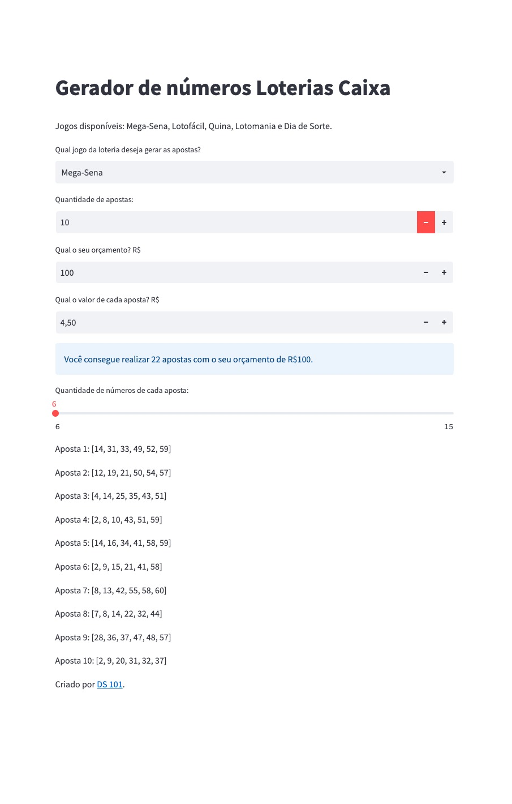

# pt-BR-Gerador-Loterias-Python
Aplicação Python com interface para geração de apostas na loteria.

O Streamlit é uma biblioteca open-soure de python para criar web apps de maneira muito fácil.   Sua instalação é necessária:  
<code>pip install streamlit as st</code>.

Para rodar a aplicação, basta acessar o terminal e digitar:  
<code>streamlit run app.py</code>

Aplicação no ar:

